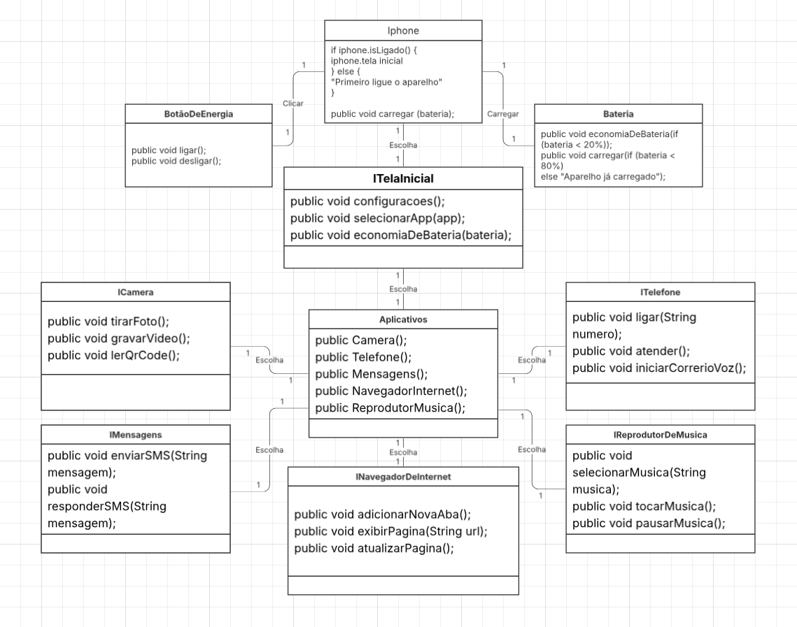

# Diagrama UML - Simulação de iPhone
> **Este projeto foi desenvolvido para aprovação no módulo de Modelagem UML do Bootcamp Santander DIO 2025.**

Este repositório apresenta um diagrama UML que simula a estrutura e funcionamento de um iPhone. O objetivo é demonstrar, de forma visual e organizada, os principais componentes, classes e relacionamentos envolvidos no modelo de um smartphone inspirado no iPhone.

## Conteúdo

- **Diagrama de Classes UML**: Representa as principais classes, atributos e métodos.
- **Relacionamentos**: Mostra como os componentes interagem entre si.
- **Exemplo de Funcionamento**: Demonstra cenários de uso comuns.

## Objetivos

- Praticar modelagem orientada a objetos.
- Visualizar a arquitetura de um dispositivo móvel.
- Facilitar o entendimento de conceitos de UML.

Além das funcionalidades propostas pelo desafio — Telefone, Music Player e Navegador — também implementei recursos extras por iniciativa própria: Mensagens, Câmera, Bateria e as funções de Ligar e Desligar o aparelho. Assim, o diagrama UML representa tanto os requisitos obrigatórios quanto funcionalidades adicionais, tornando o modelo mais completo e próximo de um smartphone real.

---

Abra o arquivo do diagrama com uma ferramenta compatível com UML, como StarUML, Lucidchart ou PlantUML.

---
Sinta-se à vontade para contribuir ou sugerir melhorias!

### 📊 Visualize o Diagrama UML

[🔗 Veja o meu Diagrama UML no Lucidchart](https://lucid.app/lucidchart/402c5c2d-5914-4dfa-a4d5-0318fbfb3e6e/edit?viewport_loc=-2049%2C-985%2C3071%2C1511%2C0_0&invitationId=inv_68c1c5b4-5ad7-4bb9-8c43-39fe7b952ed1)
 

## Autor

Desenvolvido por David Bissaco.